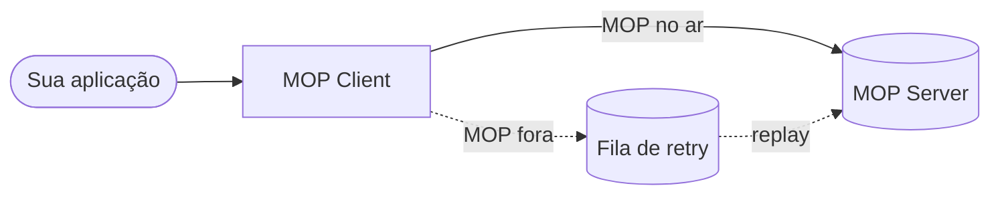

# MOP Client 

API HTTP **auto-hospedada** que cada participante do **Open Insurance Brasil** instala em seu ambiente para enviar eventos de trace ao **MOP Server**. Em uma única aplicação, executa: validação → anonimização → assinatura JWS → POST ao MOP, com **circuit breaker** e **fila de retry** quando o MOP está indisponível.

 
> [!IMPORTANT]
> Este repositório **substitui** os antigos `mop-client-data-validator-pub` e `opin-mop-client-anonymization-pub`. Não é necessário implantar/configurar aqueles componentes — basta atualizar a imagem deste gateway.

> [!NOTE]
> **Endpoints do MOP Server (por ambiente)**
>
> Configure `EXTERNAL_REQUEST_URL` e `EXTERNAL_API_DATA_ANONYMIZATION` com a URL **completa** do ambiente em que o gateway irá operar. Credenciais JWS (`JWS_KID`, `JWS_ORG_ID`, chave privada) devem estar cadastradas no **mesmo** ambiente.
>
> | Ambiente | Host base (MOP Server) | `POST /process` (`EXTERNAL_REQUEST_URL`) | `GET` regras (`EXTERNAL_API_DATA_ANONYMIZATION`) |
> |----------|------------------------|------------------------------------------|--------------------------------------------------|
> | **Sandbox** | `https://mop-server-entrypoint-sandbox.opinbrasil.com.br/` | `.../process` | `.../anonymization-fields?schema=Consent` |
> | **Produção** | **`https://mop-server-entrypoint.opinbrasil.com.br/`** | `https://mop-server-entrypoint.opinbrasil.com.br/process` | `https://mop-server-entrypoint.opinbrasil.com.br/anonymization-fields?schema=Consent` |
>
> - **GET `.../anonymization-fields?schema=Consent`**: endpoint de **configuração**. Retorna as regras dinâmicas de campos (**quais devem ser anonimizados** e **quais podem ficar expostos**) para o schema informado (ex.: `Consent`). O gateway chama esse endpoint no **início do processamento** (antes de anonimizar) e também pode usá-lo como **sonda de disponibilidade** do MOP.
> - **POST `.../process`**: endpoint de **processamento/ingestão**. Recebe o **payload final** que o gateway montou e anonimizado. No fluxo padrão, o corpo enviado ao MOP é um **JWT compacto** (`Content-Type: application/jwt`) quando a assinatura está habilitada.
>
> Em resumo: **GET = “quais campos anonimizar”**; **POST = “enviar o evento já anonimizado (e assinado)”**. Detalhes de variáveis: [`docs/VARIAVEIS_DE_AMBIENTE.md`](docs/VARIAVEIS_DE_AMBIENTE.md).

---

## Sumário

1. [Como funciona em 30 segundos](#como-funciona-em-30-segundos)
2. [Início rápido — rodando em até 10 minutos](#início-rápido--rodando-em-at\u00e9-10-minutos)
3. [Instalação em Kubernetes (Helm)](#instalação-em-kubernetes-helm)
4. ⚠️ [Antes de ir para produção](#antes-de-ir-para-produção) — **leitura obrigatória**
5. [Contrato da API](#contrato-da-api)
6. [Configuração](#configuração)
7. [Segurança e assinatura JWS](#segurança-e-assinatura-jws)
8. [Observabilidade](#observabilidade)
9. [Solução de problemas](#solução-de-problemas)
10. [Referências](#referências)


---

## Como funciona em 30 segundos

1. **Sua aplicação** envia `POST /v1/anonymize/data` com os headers de trace.
2. **O gateway** valida os headers, anonimiza o payload e assina.
3. **Envia ao MOP** — se o MOP estiver fora, **enfileira no RabbitMQ** e tenta de novo automaticamente.
4. **Você recebe `HTTP 200`** quando o MOP aceita na hora, ou **`HTTP 202`** quando o pedido é enfileirado para retry (MOP indisponível). Em ambos os casos a validação OpenAPI roda antes do envio.



> [!CAUTION]
> **`HTTP 200` ≠ entrega garantida ao MOP.** Use **`202`** quando o MOP estiver indisponível (body sem `response`). Para saber o que ocorreu, confira o **status HTTP**, os **logs** e o campo `response`. Trate como at-least-once e leia [Antes de ir para produção](#antes-de-ir-para-produção).

---

## Instalação em Kubernetes (Helm)

Em produção, o **MOP Client** pode ser implantado com o **Helm Chart** publicado no GHCR (`ghcr.io/br-openinsurance/mop-client-chart/mop-client`). O guia oficial (pré-requisitos, `values-client.yaml`, install/upgrade e verificação) está no repositório de publicação:

- **[Instalação via Helm — `INSTALA_MOP_CLIENT.md`](https://github.com/br-openinsurance/opin-mop-gateway-pub/blob/feat/mop-client-install/docs/INSTALA_MOP_CLIENT.md)** (branch `feat/mop-client-install`)
- Resumo e links neste repositório: [`docs/INSTALACAO.md`](docs/INSTALACAO.md)

Imagem Docker (GHCR, branch `develop`):

```bash
docker pull ghcr.io/br-openinsurance/opin-mop-gateway-pub/open-insurance-mop-gateway:develop
```

---

## Início rápido — rodando em até 10 minutos

> Este caminho leva você de "nunca vi o projeto" até um `200 OK` válido contra o **sandbox OPIN**. Pré-requisito: você já obteve as credenciais JWS do participante (chave privada PEM + `kid` publicado no JWKS + `orgId`). Se ainda não tem, obtenha-as antes — o gateway **não sobe sem elas**.

### Pré-requisitos

| Ferramenta | Versão | Observação |
|---|---|---|
| Docker | qualquer | Imagem do gateway + RabbitMQ |
| Credenciais JWS | — | `mop-client-sandbox.pem` (PKCS#8), `JWS_KID`, `JWS_ORG_ID` |

### Passo 1 — Baixar imagem e subir RabbitMQ (~2 min)

```bash
docker pull ghcr.io/br-openinsurance/opin-mop-gateway-pub/open-insurance-mop-gateway:develop

docker network create mop-local 2>/dev/null || true

docker run -d --name rabbitmq --network mop-local \
  -p 5672:5672 -p 15672:15672 \
  -e RABBITMQ_DEFAULT_USER=guest -e RABBITMQ_DEFAULT_PASS=guest \
  rabbitmq:4.2-management
```

Confira que o RabbitMQ está saudável:

```bash
docker ps --filter name=rabbitmq
# rabbitmq   running   0.0.0.0:5672->5672, 0.0.0.0:15672->15672
```

UI de gestão (opcional): http://localhost:15672 (`guest`/`guest`).

> **Filas RabbitMQ:** crie **as duas** filas duráveis antes do primeiro uso — `mop.client.retry.queue` (retry) e `mop.client.retry.dlq` (DLQ). Detalhes em [`docs/VARIAVEIS_DE_AMBIENTE.md`](docs/VARIAVEIS_DE_AMBIENTE.md#criação-obrigatória-das-filas) e [`docs/REPROCESSAMENTO.md`](docs/REPROCESSAMENTO.md#4-criação-das-filas-no-rabbitmq).

### Passo 2 — Configurar variáveis (~3 min)

Crie um arquivo `.env.sandbox` (ou exporte no shell). **Todas as 8 variáveis abaixo são obrigatórias** — sem elas a aplicação não sobe.

<details>
<summary><b>Linux / macOS (bash/zsh)</b></summary>

```bash
export SPRING_PROFILES_ACTIVE=local

# Endpoints do MOP (sandbox OPIN)
export EXTERNAL_REQUEST_URL="https://mop-server-entrypoint-sandbox.opinbrasil.com.br/process"
export EXTERNAL_API_DATA_ANONYMIZATION="https://mop-server-entrypoint-sandbox.opinbrasil.com.br/anonymization-fields?schema=Consent"

# RabbitMQ (container na rede mop-local)
export RABBITMQ_VALIDATOR_HOST=rabbitmq
export RABBITMQ_VALIDATOR_PORT=5672
export RABBITMQ_USERNAME=guest
export RABBITMQ_PASSWORD=guest

# Assinatura JWS (obrigatório — credenciais do participante)
export MOP_PAYLOAD_SIGNING_ENABLED=true
export JWS_PRIVATE_KEY="$(cat ./mop-client-sandbox.pem)"
export JWS_KID="<seu-kid-publicado-no-JWKS>"
export JWS_ORG_ID="<seu-orgId-uuid>"
```

</details>

<details>
<summary><b>Windows PowerShell</b></summary>

```powershell
$env:SPRING_PROFILES_ACTIVE = "local"

$env:EXTERNAL_REQUEST_URL = "https://mop-server-entrypoint-sandbox.opinbrasil.com.br/process"
$env:EXTERNAL_API_DATA_ANONYMIZATION = "https://mop-server-entrypoint-sandbox.opinbrasil.com.br/anonymization-fields?schema=Consent"

$env:RABBITMQ_VALIDATOR_HOST = "rabbitmq"
$env:RABBITMQ_VALIDATOR_PORT = "5672"
$env:RABBITMQ_USERNAME = "guest"
$env:RABBITMQ_PASSWORD = "guest"

$env:MOP_PAYLOAD_SIGNING_ENABLED = "true"
$env:JWS_PRIVATE_KEY = (Get-Content -Raw .\mop-client-sandbox.pem)
$env:JWS_KID = "<seu-kid-publicado-no-JWKS>"
$env:JWS_ORG_ID = "<seu-orgId-uuid>"
```

</details>

> [!WARNING]
> No `application.yml` base, `MOP_PAYLOAD_SIGNING_ENABLED` tem default `true`.

### Passo 3 — Subir a aplicação (~2 min)

Com o `.env.sandbox` preenchido (Passo 2):

```bash
docker run -d --name mop-client --network mop-local -p 8080:8080 \
  --env-file .env.sandbox \
  ghcr.io/br-openinsurance/opin-mop-gateway-pub/open-insurance-mop-gateway:develop
```

Quando o container estiver `running`, a aplicação responde na porta **8080** com context-path `/v1/anonymize`. Acompanhe os logs:

```bash
docker logs -f mop-client
# Espere: Started MopClientApplication in X.X seconds (process running for ...)
```

### Passo 4 — Smoke test (~1 min)

Health check:

```bash
curl -s http://localhost:8080/v1/anonymize/actuator/health | jq .
# Espere: {"status":"UP", ...} com circuitBreakers e rabbit em UP
```

Primeira requisição:

```bash
curl -i -X POST http://localhost:8080/v1/anonymize/data \
  -H "X-Correlation-Id: $(uuidgen)" \
  -H "origin: client" \
  -H "httpType: Request" \
  -H "path: /open-insurance/consents/v3/consents" \
  -H "operation: POST" \
  -H "Content-Type: application/json" \
  -d '{
    "data": {
      "permissions": ["RESOURCES_READ"],
      "loggedUser": {
        "document": { "identification": "11111111111", "rel": "CPF" }
      },
      "expirationDateTime": "2026-12-31T23:59:59Z"
    }
  }'
```

Resposta esperada:

```http
HTTP/1.1 200
Content-Type: application/json

{
  "message": "Request processed successfully. Your data has been received and forwarded to the server.",
  "timestamp": "2026-04-27T11:00:01.234Z",
  "context": {
    "correlationId": "f47ac10b-58cc-4372-a567-0e02b2c3d479",
    "clientSSId": "RECEPTORA-A",
    "serverASId": "TRANSMISSORA-B"
  },
  "request": {
    "path": "/open-insurance/consents/v3/consents",
    "operation": "POST",
    "header": {
      "x-correlation-id": "f47ac10b-58cc-4372-a567-0e02b2c3d479",
      "origin": "client",
      "httpType": "Request",
      "path": "/open-insurance/consents/v3/consents",
      "operation": "POST",
      "content-type": "application/json"
    }
  },
  "response": {
    "status": 201,
    "body": {
      "message": "Request dispatched for processing.",
      "status": "success"
    }
  },
  "validations": {
    "status": "SUCCESS",
    "total": 0,
    "pending": []
  }
}
```

### Passo 5 — Validar entrega real ao MOP (~2 min)

Como o **202** indica enfileiramento e o **200** com `response` indica entrega síncrona, **sempre** valide pelos logs quando houver dúvida:

```bash
# Log de entrega confirmada:
# "Payload successfully processed. clientSSId=... correlationId=..."

# Log de enfileiramento (MOP indisponível):
# HTTP 202 — "[MOP retry] ... body sent to retry queue | correlationId=..."
```

E pela profundidade da fila no RabbitMQ:

```bash
# Via Management UI (http://localhost:15672) → Queues → mop.client.retry.queue
# Mensagens em "Ready" devem cair para zero em até MOP_CLIENT_RETRY_REPLAY_INTERVAL_MS
```

✅ Se o log mostrou `Payload successfully processed`, você está integrado.

---

## Antes de ir para produção

Esta seção lista os **riscos operacionais reais** do gateway. Não pule.

### 1. ⚠️ HTTP 200 não garante entrega ao MOP

O gateway retorna corpos distintos para entrega síncrona (**200**) e enfileiramento (**202**). Não confie apenas no código HTTP sem verificar logs e o campo `response`.

| Cenário | Status HTTP | Como detectar |
|---|---|---|
| Entregue ao MOP | 200 | Log: `Payload successfully processed` · body com `response` do MOP |
| **Apenas enfileirado para retry** | 202 | Log: `[MOP retry]` · body com mensagem de fila · sem `response` |

**Implicações para produção:**

- Não confie apenas no status HTTP para confirmar entrega.
- Monitore: profundidade da fila `mop.client.retry.queue`, taxa de eventos `[MOP retry]`, estado dos circuit breakers `mopProcessEndpoint` e `mopAnonymizationConfig` no `actuator/health`.
- Modelo de entrega = **at-least-once**. O servidor MOP precisa deduplicar por `X-Correlation-Id` ou `mopReportId`. **Use UUID por intenção lógica** e nunca repita um `correlationId` para operações distintas.
- Se o MOP ficar fora por mais que `(tamanho_máx_da_fila × tempo_médio_da_mensagem)`, mensagens novas começam a falhar. Dimensione o broker para o pior cenário.

### 2. RabbitMQ é obrigatório no boot e durante operação

Sem RabbitMQ a aplicação **não sobe**. Em runtime, se o broker cair:
- Mensagens novas que precisariam ir para retry **falham**.
- Mensagens já enfileiradas ficam intactas (persistentes), mas não serão drenadas.

**Pré-requisito:** no broker, **crie as duas filas duráveis** — `mop.client.retry.queue` (retry) e `mop.client.retry.dlq` (DLQ). Nomes customizados via `MOP_CLIENT_RETRY_QUEUE` e `MOP_CLIENT_RETRY_DLQ_QUEUE`. Ver [`docs/VARIAVEIS_DE_AMBIENTE.md`](docs/VARIAVEIS_DE_AMBIENTE.md#criação-obrigatória-das-filas).

**Recomendações:** RabbitMQ em cluster com `quorum queue` (não classic), TTL configurado para a fila de retry, e DLQ separada (`mop.client.retry.dlq`).

### 3. Chave privada JWS em variável de ambiente é desencorajada

`JWS_PRIVATE_KEY` recebe o PEM completo. Em produção:
- Monte o PEM como **arquivo via secret** (Kubernetes Secret, AWS Secrets Manager, Vault) e leia para a env var apenas no entrypoint do container.
- Garanta rotação documentada — coordenando com a publicação do JWKS para evitar janela de `401`.
- Habilite `MOP_PAYLOAD_SIGNING_ENABLED=true` **explicitamente** (produção) e garanta `JWS_PRIVATE_KEY`/`JWS_KID`/`JWS_ORG_ID` preenchidos.

### 4. `kid` precisa estar publicado no JWKS antes do primeiro request

O servidor MOP responde **`401`** se o `kid` do JWT não casar com nenhuma chave do JWKS publicado pelo participante. Sequência segura:

1. Gerar par de chaves.
2. Publicar a pública no JWKS do participante (com o `kid` correspondente).
3. Aguardar o cache do MOP refletir (~minutos).
4. **Só então** subir o gateway com a nova chave.

### 5. Headers HTTP fora de convenção

Os headers `origin`, `path`, `operation`, `clientSSId`, `serverASId` **não usam o prefixo `X-`** e nem kebab-case. Riscos:

- `origin` colide com o header padrão CORS — proxies/CDN podem **sobrescrevê-lo**. Audite o caminho da requisição (Cloudflare, AWS ALB, NGINX) e garanta que esses headers passem intactos.
- Logs centralizados (Datadog, ELK) tratam `path`/`operation` como termos genéricos — adicione tags próprias para não conflitar.

### 6. Resposta de erro `400` tem **dois formatos**

| Origem do erro | Formato |
|---|---|
| Validação de header pelo controller | JSON estruturado (`error`, `details`, `timestamp`) |
| Header obrigatório ausente / JSON malformado | **Array de strings** (`["Missing required header: ...", "Details: ..."]`) |

Seu cliente HTTP **precisa** lidar com ambos os formatos.

### 7. Checklist mínimo de produção

- [ ] Filas RabbitMQ **`mop.client.retry.queue`** e **`mop.client.retry.dlq`** criadas (duráveis) no broker.
- [ ] `EXTERNAL_REQUEST_URL` aponta para **produção**: `https://mop-server-entrypoint.opinbrasil.com.br/process` (não usar host sandbox).
- [ ] `EXTERNAL_API_DATA_ANONYMIZATION` aponta para **produção**: `https://mop-server-entrypoint.opinbrasil.com.br/anonymization-fields?schema=Consent`.
- [ ] `MOP_PAYLOAD_SIGNING_ENABLED=true` **e** `JWS_PRIVATE_KEY`/`JWS_KID`/`JWS_ORG_ID` definidos.
- [ ] `kid` publicado no JWKS e propagado.
- [ ] RabbitMQ com persistência, em cluster, monitorado (profundidade de fila, conexões).
- [ ] Logs em JSON estruturado, exportados com `correlationId` indexado.
- [ ] Alertas em: `mop.client.retry.queue.depth > X`, circuit `mopProcessEndpoint == OPEN > Y minutos`, taxa de `[MOP retry]` por minuto.
- [ ] Health check `/v1/anonymize/actuator/health` integrado ao orquestrador (Kubernetes liveness/readiness).
- [ ] Variáveis sensíveis fora de logs e fora do dump da JVM.

---

## Contrato da API

### Endpoint

**`POST /v1/anonymize/data`** — `Content-Type: application/json` · body opcional (corpo vazio ou inválido é normalizado para `{}`).

### Headers obrigatórios

| Header | Descrição | Restrições | Exemplo |
|---|---|---|---|
| `X-Correlation-Id` | ID da intenção lógica (idempotência at-least-once). | Não vazio, ≥ 1 char. **Recomendado: UUID v4.** | `f47ac10b-58cc-4372-a567-0e02b2c3d479` |
| `origin` | Origem da chamada no fluxo MOP. | `client` (com `httpType=Request`) ou `server` (com `httpType=Response`), case-insensitive. Combinações inconsistentes retornam HTTP 400. | `client` |
| `path` | Path **concreto** da transação Open Insurance (`basePath + operationPath` com IDs reais). | Não vazio; deve começar com `/open-insurance/` após normalização. **Não** use `{consentId}` literal nem só `/consents`. Ver [`docs/PATH_MOP_HEADER.md`](docs/PATH_MOP_HEADER.md). | `/open-insurance/consents/v3/consents` |
| `operation` | Verbo HTTP da operação original. | `GET`, `POST`, `PUT`, `PATCH`, `DELETE`, `HEAD`, `OPTIONS`, `TRACE`. | `POST` |
| `httpType` | Tipo da mensagem HTTP no fluxo MOP. | `Request` ou `Response` (case-insensitive). Deve casar com `origin`: `client`→`Request`, `server`→`Response`. | `Request` |
| `statusCode` | Código HTTP da mensagem original. | **Condicional:** opcional quando `httpType=Request`; **obrigatório** quando `httpType=Response` (100–599). Com `Response`, use o status da **spec Open Insurance** (ex.: `201` no POST consents v3). | `201` |

### Headers opcionais

| Header | Descrição | Comportamento | Exemplo |
|---|---|---|---|
| `clientSSId` | Identificador da receptora (SS). | Ecoado em `context.clientSSId`; se ausente, usa `origin` na resposta. | `RECEPTORA-A` |
| `serverASId` | Identificador da transmissora (AS). | Ecoado em `context.serverASId`; string vazia se ausente. | `TRANSMISSORA-B` |
| `traceOrigin` | Origem do evento de trace. | Repassado ao MOP em `trace.traceOrigin` do `MessageDTO`. | `CLIENT` |
| `X-Mop-Reportid` | ID de rastreio MOP interno. | Gerado pelo gateway se omitido. | `mop-report-7f3c9a2b` |

**Combinações válidas de `origin`, `httpType` e `statusCode`**

O gateway aceita **apenas duas combinações** para validação OpenAPI. Qualquer outro par retorna **HTTP 400** (`HeaderValidator`).

| `origin` | `httpType` | `statusCode` | O que valida no body | Cenário típico |
|---|---|---|---|---|
| `client` | `Request` | omitido ou 100–599 | **requestBody** da operação (`path` + `operation`) | Payload que a **receptora enviou** à transmissora |
| `server` | `Response` | **obrigatório** (100–599) | **response body** da operação para o `statusCode` informado | Payload que a **transmissora devolveu** à receptora |

Combinações **rejeitadas** (HTTP 400):

| `origin` | `httpType` | Erro |
|---|---|---|
| `client` | `Response` | `httpType` deve ser `Request` |
| `server` | `Request` | `httpType` deve ser `Response` |
| `server` | `Response` | `statusCode` omitido — obrigatório com `httpType=Response` |

> **`statusCode` não é o HTTP da resposta do gateway.** É o status HTTP **da transação Open Insurance** que você está reportando. Ex.: criar consentimento (POST `/consents`) retorna **201** na spec — use `statusCode: 201`, não `200`. Com `statusCode` errado, o validador pode aplicar o schema de **erro** (`ResponseError` com campo `errors`) e falhar em bodies de sucesso (`data`, `links`).

**Exemplo — request do cliente (criar consentimento v3)**

```bash
curl -i -X POST http://localhost:8080/v1/anonymize/data \
  -H "X-Correlation-Id: $(uuidgen)" \
  -H "origin: client" \
  -H "httpType: Request" \
  -H "path: /open-insurance/consents/v3/consents" \
  -H "operation: POST" \
  -H "Content-Type: application/json" \
  -d '{
    "data": {
      "permissions": ["RESOURCES_READ"],
      "loggedUser": {
        "document": { "identification": "11111111111", "rel": "CPF" }
      },
      "expirationDateTime": "2026-12-31T23:59:59Z"
    }
  }'
```

Valida o schema **`CreateConsent`** (requestBody do POST).

**Exemplo — response do servidor (consentimento criado, status 201)**

```bash
curl -i -X POST http://localhost:8080/v1/anonymize/data \
  -H "X-Correlation-Id: $(uuidgen)" \
  -H "origin: server" \
  -H "httpType: Response" \
  -H "statusCode: 201" \
  -H "path: /open-insurance/consents/v3/consents" \
  -H "operation: POST" \
  -H "Content-Type: application/json" \
  -d '{
    "data": {
      "consentId": "urn:prudential:C1DD93123",
      "creationDateTime": "2021-05-21T08:30:00Z",
      "status": "AWAITING_AUTHORISATION",
      "statusUpdateDateTime": "2021-05-21T08:30:00Z",
      "permissions": ["RESOURCES_READ"],
      "expirationDateTime": "2021-05-21T08:30:00Z"
    },
    "links": {
      "self": "https://api.organizacao.com.br/open-insurance/consents/v3/consents/urn:prudential:C1DD93123"
    },
    "meta": { "totalRecords": 1, "totalPages": 1 }
  }'
```

Valida o schema **`ResponseConsent`** (resposta `201` do POST). Consulte `consents_v3.yaml` para o status correto de cada operação.

**Regras de `origin`, `httpType` e `statusCode` (referência rápida)**

| `origin` | `httpType` | `statusCode` | Validação OpenAPI |
|---|---|---|---|
| `client` | `Request` | omitido | Body como **request** da operação |
| `client` | `Request` | informado | Body como **request** (statusCode deve ser 100–599 se informado) |
| `client` | `Response` | — | **HTTP 400** — `httpType` deve ser `Request` |
| `server` | `Response` | omitido | **HTTP 400** — `statusCode` obrigatório |
| `server` | `Response` | informado | Body como **response** do status informado na spec |
| `server` | `Request` | — | **HTTP 400** — `httpType` deve ser `Response` |

| `httpType` | `statusCode` | Comportamento |
|---|---|---|
| `Request` | omitido | Aceito. |
| `Request` | informado | Deve ser um código HTTP válido (100–599). |
| `Response` | omitido | **HTTP 400** — `Header 'statusCode' is required when 'httpType' is 'Response'`. |
| `Response` | informado | Obrigatório; deve ser 100–599 e **casar com a resposta definida no OpenAPI** para `path` + `operation`. |

Exemplo legado com `httpType=Response` (GET identifications — status 200):

```bash
curl -i -X POST http://localhost:8080/v1/anonymize/data \
  -H "X-Correlation-Id: $(uuidgen)" \
  -H "origin: server" \
  -H "path: /open-insurance/customers/v2/personal/identifications" \
  -H "operation: GET" \
  -H "httpType: Response" \
  -H "statusCode: 200" \
  -H "clientSSId: RECEPTORA-A" \
  -H "serverASId: TRANSMISSORA-B" \
  -H "Content-Type: application/json" \
  -d '{"data":[],"links":{"self":"..."},"meta":{"totalRecords":0,"totalPages":1}}'
```

### Resposta — `200 OK`

```json
{
  "message": "Request processed successfully. Your data has been received and forwarded to the server.",
  "timestamp": "2026-04-27T11:00:01.234Z",
  "context": {
    "correlationId": "f47ac10b-58cc-4372-a567-0e02b2c3d479",
    "clientSSId": "RECEPTORA-A",
    "serverASId": "TRANSMISSORA-B"
  },
  "request": {
    "path": "/open-insurance/consents/v3/consents",
    "operation": "POST",
    "header": {
      "x-correlation-id": "f47ac10b-58cc-4372-a567-0e02b2c3d479",
      "origin": "client",
      "httpType": "Request",
      "path": "/open-insurance/consents/v3/consents",
      "operation": "POST",
      "content-type": "application/json"
    }
  },
  "response": {
    "status": 201,
    "body": {
      "message": "Request dispatched for processing.",
      "status": "success"
    }
  },
  "validations": {
    "status": "SUCCESS",
    "total": 0,
    "pending": []
  }
}
```

> Resposta **200** com `response` = entrega síncrona ao MOP. Resposta **202** = enfileirado para retry (sem `response`). Ver [Antes de ir para produção §1](#1-️-http-200-não-garante-entrega-ao-mop).

### Resposta — `202 Accepted` (MOP indisponível — enfileirado)

```json
{
  "message": "Request accepted and queued for later delivery to the server (MOP unavailable).",
  "timestamp": "2026-04-27T11:00:01.234Z",
  "context": {
    "correlationId": "f47ac10b-58cc-4372-a567-0e02b2c3d479",
    "clientSSId": "RECEPTORA-A",
    "serverASId": "TRANSMISSORA-B"
  },
  "request": {
    "path": "/open-insurance/consents/v3/consents",
    "operation": "POST",
    "header": {
      "x-correlation-id": "f47ac10b-58cc-4372-a567-0e02b2c3d479",
      "origin": "client",
      "httpType": "Request",
      "path": "/open-insurance/consents/v3/consents",
      "operation": "POST",
      "content-type": "application/json"
    }
  },
  "validations": {
    "status": "SUCCESS",
    "total": 0,
    "pending": []
  }
}
```

### Resposta — `400 Bad Request` (validação do controller)

```json
{
  "error": "Invalid header",
  "details": "Header 'origin' must be either 'client' or 'server'",
  "timestamp": "2026-04-27T11:00:01.234Z"
}
```

### Resposta — `400 Bad Request` (header ausente / JSON ilegível)

> ⚠️ Formato **diferente** do anterior — seu cliente precisa tratar os dois.

```json
[
  "Missing required header: httpType",
  "Details: Required request header 'httpType' for method parameter type String is not present"
]
```

### Resposta — `500 Internal Server Error`

Pode vir em **dois formatos** (controller estruturado **ou** array do `GlobalExceptionHandler`). Sempre logado com stack trace no servidor; não exponha o `details` ao usuário final.

---

## Configuração

### Profiles Spring

| Profile | Arquivo | Quando usar |
|---|---|---|
| (sem) `default` | `application.yml` | Base. Não use diretamente em dev — exige todas as variáveis sem default. |
| `local` | `application-local.yml` | Desenvolvimento local. Sobrescreve porta, fila, intervalo de replay (30 min vs 10 s no base). |

Ative com `SPRING_PROFILES_ACTIVE=local` ou `--spring.profiles.active=local`.

### Variáveis de ambiente — essenciais

> **Para a tabela completa**, com defaults e binding, veja [`docs/VARIAVEIS_DE_AMBIENTE.md`](docs/VARIAVEIS_DE_AMBIENTE.md).

#### Obrigatórias (sem default — aplicação falha sem elas)

| Variável | Descrição |
|---|---|
| `SPRING_PROFILES_ACTIVE` | Perfil Spring (`local` em dev, vazio/`default` em prod). |
| `EXTERNAL_HOST` | Host base do MOP. Preferir URLs completas abaixo. |
| `EXTERNAL_REQUEST_URL` | URL completa do `POST /process`. Produção: `https://mop-server-entrypoint.opinbrasil.com.br/process` · Sandbox: `https://mop-server-entrypoint-sandbox.opinbrasil.com.br/process` |
| `EXTERNAL_API_DATA_ANONYMIZATION` | URL completa do `GET` de regras. Produção/sandbox: mesmo host do ambiente + `/anonymization-fields?schema=Consent` |
| `MOP_PAYLOAD_SIGNING_ENABLED` | **`true`** em prod (default no `application.yml` base). Em produção, defina explicitamente junto com `JWS_PRIVATE_KEY`/`JWS_KID`/`JWS_ORG_ID`. |
| `JWS_PRIVATE_KEY` | Chave privada PKCS#8 em PEM. |
| `JWS_KID` | `kid` publicado no JWKS do participante. |
| `JWS_ORG_ID` | `orgId` (UUID) do participante. |

#### RabbitMQ (todas obrigatórias — **sem default**, aplicação falha no boot sem elas)

| Variável | Descrição |
|---|---|
| `RABBITMQ_VALIDATOR_HOST` | Nome herdado do antigo "validator" — **será renomeado**. Em dev local: `localhost`. |
| `RABBITMQ_VALIDATOR_PORT` | Em dev local: `5672`. |
| `RABBITMQ_USERNAME` | Em dev local: `guest`. |
| `RABBITMQ_PASSWORD` | Em dev local: `guest`. |

#### Retry e disponibilidade do MOP

| Variável | Default | Descrição |
|---|---|---|
| `MOP_CLIENT_RETRY_QUEUE` | `mop.client.retry.queue` | Nome da fila AMQP de **retry** — deve existir no broker (durável). |
| `MOP_CLIENT_RETRY_DLQ_QUEUE` | `mop.client.retry.dlq` | Nome da fila **DLQ** — deve existir no broker (durável). |
| `MOP_CLIENT_RETRY_DLQ_MAX_ATTEMPTS` | `5` | Tentativas de replay antes de mover para a DLQ. |
| `MOP_CLIENT_RETRY_REPLAY_ENABLED` | `true` | Liga o replay agendado. |
| `MOP_CLIENT_RETRY_REPLAY_INITIAL_DELAY_MS` | `15000` | Atraso da primeira drenagem após o boot. |
| `MOP_CLIENT_RETRY_REPLAY_INTERVAL_MS` | `10000` *(base)* / `1800000` *(local)* | **Diverge entre profiles** — confira o seu. |
| `MOP_CLIENT_RETRY_REPLAY_MAX_PER_TICK` | `25` | Lote por ciclo. |
| `MOP_SERVER_AVAILABILITY_CHECK_ENABLED` | `true` | Sondas HTTP de disponibilidade. |
| `MOP_SERVER_AVAILABILITY_CHECK_INTERVAL_MS` | `30000` | |
| `MOP_SERVER_AVAILABILITY_CONNECT_TIMEOUT_MS` | `3000` | |
| `MOP_SERVER_AVAILABILITY_READ_TIMEOUT_MS` | `5000` | |

### Precedência das URLs do MOP

```
1º) EXTERNAL_REQUEST_URL                      (vence tudo)
2º) EXTERNAL_REQUEST_HOST + EXTERNAL_REQUEST_PATH
3º) EXTERNAL_HOST          + /process
4º) external.server.request.url               (LEGADO — será removido)
```

---

## Segurança e assinatura JWS

Quando `MOP_PAYLOAD_SIGNING_ENABLED=true`, o gateway assina o **payload final enviado ao MOP** como um JWT compacto, com:

| Item | Valor |
|---|---|
| Algoritmo | `PS256` (RSA-PSS / SHA-256) |
| Header `kid` | `JWS_KID` (deve casar com chave publicada no JWKS do participante) |
| Claim `orgId` | `JWS_ORG_ID` |
| Body assinado | JSON serializado do `MessageDTO` (inclui `trace`, headers, payload anonimizado) |

**Boas práticas operacionais:**

- Rotacione a chave a cada N meses, **publicando a nova no JWKS antes** de mudar o `JWS_KID` do gateway.
- Mantenha pelo menos uma chave antiga no JWKS por uma janela de tolerância (~24 h) para mensagens drenadas da fila de retry.
- Nunca logue o conteúdo de `JWS_PRIVATE_KEY`. Mascarar em qualquer APM/logger.

---

## Observabilidade

### Endpoints do Actuator

Todos sob `/v1/anonymize/actuator/*`:

| Endpoint | Uso | Exemplo |
|---|---|---|
| `/health` | Liveness/readiness — inclui `circuitBreakers`, `rabbit`, `diskSpace`. | `curl http://localhost:8080/v1/anonymize/actuator/health` |
| `/health/circuitBreakers` | Estado dos circuitos `mopAnonymizationConfig` e `mopProcessEndpoint`. | — |
| `/metrics` | Métricas Micrometer (HTTP, JVM, RabbitMQ, Resilience4j). | `/metrics/resilience4j.circuitbreaker.state` |
| `/info` | Metadados da aplicação. | — |

> [!WARNING]
> No `application.yml` base, `management.endpoints.web.exposure.include` está como `"*"` (todos expostos). Em produção, restrinja via `MANAGEMENT_ENDPOINTS_INCLUDE=health,info,metrics,prometheus` e proteja por rede/auth.

### Logs estruturados a monitorar

| Padrão de log | Significado | Ação |
|---|---|---|
| `Payload successfully processed. clientSSId=... correlationId=...` | Entrega ao MOP confirmada. | OK. |
| `[MOP retry] Client received HTTP 202; body sent to retry queue` | Mensagem **enfileirada**, não entregue. | Alertar se taxa elevada. |
| `[OPENAPI]` (startup) | Specs Open Insurance carregadas; rota consents v3 verificada. | Conferir log no boot; ausência de WARN indica registry OK. |
| `Header validation failed: ...` | `400` por validação. | Sem ação se baixa frequência. |
| `Failed to process JSON: ...` | `400` por JSON ilegível. | Sem ação se baixa frequência. |
| `Unexpected error processing request: ...` | `500`. | **Alertar imediatamente.** |

---

## Solução de problemas

| Sintoma | Causa provável | Solução |
|---|---|---|
| App falha no boot: `MOP_PAYLOAD_SIGNING_ENABLED=true requires ...` | Assinatura habilitada sem `JWS_PRIVATE_KEY`/`JWS_KID`/`JWS_ORG_ID`. | Defina as três variáveis (produção) ou ajuste `MOP_PAYLOAD_SIGNING_ENABLED=false` (dev). |
| App falha no boot: `JWS_KID must not be blank` | `JWS_KID` ou `JWS_ORG_ID` vazio. | Defina ambas as variáveis. |
| App falha no boot: `Connection refused: amqp://localhost:5672` | RabbitMQ ausente ou host incorreto no container. | Suba o RabbitMQ (ver [início rápido](#passo-1--baixar-imagem-e-subir-rabbitmq-2-min)); use `RABBITMQ_VALIDATOR_HOST=rabbitmq` na rede `mop-local`. |
| Todas as respostas com log `[MOP retry]` (HTTP **202**, sem `response` no body) | MOP indisponível **ou** circuit `mopProcessEndpoint` aberto. | Cheque `/actuator/health` → seção `circuitBreakers`; valide `EXTERNAL_REQUEST_URL` e conectividade. |
| `validations.status: ERROR` com `Operation path not found from URL '/consents'` | Header `path` enviado só com o segmento da operação, sem `basePath`. | Use path MOP completo: `/open-insurance/consents/v3/consents`. Ver [`docs/PATH_MOP_HEADER.md`](docs/PATH_MOP_HEADER.md). |
| `validations.status: ERROR` pedindo campo `errors` em body com `data`/`links` | `origin: server` + `httpType: Response` com `statusCode` errado (ex.: `200` no POST consents). | Use o status da spec (POST consents v3 sucesso = **`201`**). |
| `400` — `path` must start with /open-insurance/` | Path incompleto ou URL sem trecho Open Insurance reconhecível. | Aplicar fórmula `basePath + operationPath`; não enviar `/consents` isolado. |
| `400 Header 'httpType' must be 'Request' when 'origin' is 'client'` | Par `origin`/`httpType` inconsistente. | `client`+`Request` ou `server`+`Response`+`statusCode`. |
| `401 Unauthorized` recebido do MOP | `kid` desconhecido pelo MOP, ou JWS expirado, ou `orgId` inválido. | Confira que a chave pública está no JWKS do participante e propagada; valide `JWS_KID` e `JWS_ORG_ID`. |
| `400 Header 'origin' must be either 'client' or 'server'` | Header `origin` foi sobrescrito pelo proxy/CDN (colisão com CORS). | Force preservação do header no proxy ou troque de cliente para enviar valor explícito. |
| `400 Header 'operation' must be one of: ...` | Verbo HTTP inválido (ex.: `OPTIONS`). | Use `GET/POST/PUT/PATCH/DELETE`. |
| Resposta `400` veio como **array** em vez de objeto | Erro de header ausente ou body malformado (`GlobalExceptionHandler`). | Seu cliente precisa parsear ambos os formatos — ver [§ Resposta 400](#resposta--400-bad-request-header-ausente--json-ilegível). |
| Replay nunca drena a fila | `MOP_CLIENT_RETRY_REPLAY_ENABLED=false`, ou MOP ainda indisponível, ou intervalo muito grande. | Ver `mop.client.retry.replay.*` e logs do `ClientRetryReplayScheduler`. |

---

## Referências

### Documentação interna

- [`docs/INSTALACAO.md`](docs/INSTALACAO.md) — instalação em Kubernetes via **Helm** (link para o guia oficial no `opin-mop-gateway-pub`).
- [`docs/VARIAVEIS_DE_AMBIENTE.md`](docs/VARIAVEIS_DE_AMBIENTE.md) — todas as variáveis e propriedades, com binding.
- [`docs/REPROCESSAMENTO.md`](docs/REPROCESSAMENTO.md) — fila de retry, caches, retentativas, DLQ.
- [`docs/PATH_MOP_HEADER.md`](docs/PATH_MOP_HEADER.md) — fórmula do header `path` e specs em `swagger/current/`.
- [`wiki.md`](wiki.md#varreduras-de-vulnerabilidade) — varreduras de vulnerabilidade (Trivy, Tenable).
- [`wiki.md`](wiki.md) — arquitetura interna.
- [`src/main/resources/mop-gateway-api-specification.yml`](src/main/resources/mop-gateway-api-specification.yml) — contrato HTTP do gateway.
- [`src/main/resources/swagger/current/`](src/main/resources/swagger/current/) — specs Open Insurance usadas na validação.

### Repositórios descontinuados

> Mantidos por histórico. **Não precisam ser implantados.**

- [`mop-client-data-validator-pub`](https://github.com/br-openinsurance/mop-client-data-validator-pub)
- [`opin-mop-client-anonymization-pub`](https://github.com/br-openinsurance/opin-mop-client-anonymization-pub)

### Documentação externa

- [Spring Boot](https://docs.spring.io/spring-boot/documentation.html)
- [Resilience4j](https://resilience4j.readme.io/)
- [RabbitMQ](https://www.rabbitmq.com/documentation.html)
- [Open Insurance Brasil](https://www.gov.br/susep/pt-br/assuntos/open-insurance)
- [RFC 7807 — Problem Details for HTTP APIs](https://datatracker.ietf.org/doc/html/rfc7807)

