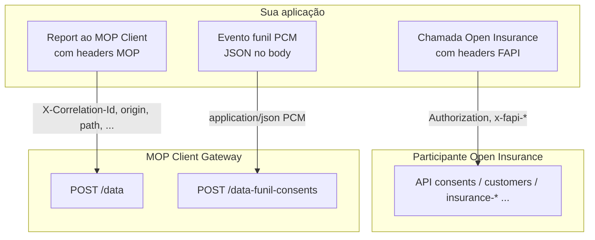

# ⚠️ ALERTA — Headers da aplicação × headers do MOP Client × validação por produto

> **Público:** seguradoras, receptores, transmissores e times de integração Open Insurance Brasil.  
> **Objetivo:** evitar confusão entre headers usados nas **APIs Open Insurance** (aplicação) e headers exigidos pelo **MOP Client Gateway** (rastreio MOP), e deixar claro que **cada produto/API tem contrato e validação próprios**.

---

## Resumo em uma frase

**Headers que sua aplicação envia ao parceiro Open Insurance ≠ headers que você envia ao MOP Client Gateway.**  
Além disso, **cada produto** (`consents`, `customers`, `insurance-auto`, `quote-*`, funil PCM, etc.) usa **spec OpenAPI diferente**, **path diferente** e **regras de validação diferentes**.

---

## 1. Dois (ou três) contextos distintos — não misture

| Contexto | Quem recebe | O que são esses headers | Exemplos |
|----------|-------------|-------------------------|----------|
| **A. APIs Open Insurance (aplicação)** | Outro participante (transmissora/receptora) | Headers **FAPI-BR / Open Insurance** da transação real entre instituições | `Authorization`, `x-fapi-interaction-id`, `x-fapi-auth-date`, `x-idempotency-key`, `x-customer-user-agent`, `x-fapi-customer-ip-address` |
| **B. MOP Client — rastreio (`POST /data`)** | **Seu** MOP Client Gateway (auto-hospedado) | Headers **MOP de trace** que descrevem *qual* operação Open Insurance você está reportando | `X-Correlation-Id`, `origin`, `path`, `operation`, `httpType`, `statusCode` (condicional), opcionais `clientSSId`, `serverASId`, `traceOrigin`, `X-Mop-Reportid` |
| **C. MOP Client — funil PCM (`POST /data-funil-consents`)** | **Seu** MOP Client Gateway | **Sem** headers MOP de trace; identificadores vão **no corpo JSON** PCM | `correlationId`, `consentId`, `step`, `clientOrgId`, `clientSSId`, `serverOrgId`, `serverASId`, … |



---

## 2. Headers da aplicação (APIs Open Insurance)

Quando sua aplicação chama **diretamente** uma API Open Insurance de outro participante, valem as regras do **perfil FAPI-BR** e da **spec daquela API** (consents v3, customers v2, insurance-auto v1, etc.).

| Tipo | Exemplos típicos | Observação |
|------|------------------|------------|
| Autenticação | `Authorization: Bearer {access_token}` | Token obtido via OAuth2 (`client_credentials`, etc.) |
| FAPI | `x-fapi-interaction-id`, `x-fapi-auth-date` | Obrigatórios nas APIs protegidas conforme guia Open Insurance |
| Idempotência | `x-idempotency-key` | Quando a operação exige (ver spec do produto) |
| Outros | `x-customer-user-agent`, `x-fapi-customer-ip-address` | Conforme operação de Fases 1,2,3 |

> **⚠️ ALERTA:** esses headers **não substituem** os headers MOP do `POST /data`.  
> O gateway MOP **não valida** se você enviou `Authorization` ou `x-fapi-interaction-id` — ele valida o **JSON do body** contra a spec indicada pelos headers `path`, `operation`, `httpType` e `statusCode`.

> **⚠️ ALERTA:** **não reporte** ao MOP Client chamadas ao **token endpoint OAuth** (`/as/token.oauth2`). Elas **não têm** spec em `swagger/current/` e serão rejeitadas. Reporte a **transação Open Insurance** que usa o token (ex.: POST `/open-insurance/consents/v3/consents`). Ver [`PATH_MOP_HEADER.md`](PATH_MOP_HEADER.md#fora-do-escopo-oauth-e-token-endpoint).

---

## 3. Headers obrigatórios do MOP Client (`POST /data`)

Endpoint: **`POST {context-path}/data`** (padrão: `POST /v1/anonymize/data`).

### Obrigatórios

| Header | Função | Regra resumida |
|--------|--------|----------------|
| `X-Correlation-Id` | Correlação lógica do evento | Não vazio; recomendado UUID |
| `origin` | Quem reporta | `client` ou `server` (case-insensitive) |
| `path` | Path **completo** Open Insurance | Deve normalizar para `/open-insurance/...` |
| `operation` | Verbo HTTP original | `GET`, `POST`, `PUT`, `PATCH`, `DELETE`, … |
| `httpType` | Tipo da mensagem reportada | `Request` ou `Response` |
| `statusCode` | Status HTTP da mensagem original | **Obrigatório** quando `httpType=Response`; opcional quando `Request` |

### Opcionais (gateway)

| Header | Quando usar |
|--------|-------------|
| `clientSSId` | Fases **2 e 3** — identificador da receptora (SS) |
| `serverASId` | Identificador da transmissora (AS) |
| `traceOrigin` | Origem do trace (ex.: `CLIENT`) |
| `X-Mop-Reportid` | Rastreio interno MOP; gerado se omitido |

### Combinações **válidas** (`origin` + `httpType`)

| `origin` | `httpType` | `statusCode` | O que o gateway valida no body |
|----------|------------|--------------|--------------------------------|
| `client` | `Request` | opcional | **requestBody** da operação (`path` + `operation`) |
| `server` | `Response` | **obrigatório** | **response body** do status informado na spec |

Qualquer outra combinação → **HTTP 400** (`HeaderValidator`).

Detalhes completos: [`README.md` — Contrato da API](../README.md#contrato-da-api) · [`CENARIOS_TESTE_QA.md`](CENARIOS_TESTE_QA.md).

---

## 4. Funil de consentimentos PCM (`POST /data-funil-consents`) — contrato **diferente**

Endpoint: **`POST {context-path}/data-funil-consents`** (padrão: `POST /v1/anonymize/data-funil-consents`).

| Aspecto | `POST /data` (rastreio) | `POST /data-funil-consents` (PCM) |
|---------|-------------------------|-----------------------------------|
| Headers MOP (`origin`, `path`, …) | **Sim — obrigatórios** | **Não utiliza** |
| `Content-Type` | `application/json` | `application/json` (ingresso); envio ao MOP `/metrics` é `application/jwt` (assinado pelo gateway) |
| Identificadores | Headers + body | **Corpo JSON:** `correlationId`, `consentId`, `step`, org/SS IDs, … |
| Validação OpenAPI | Spec do produto em `swagger/current/` conforme `path` | Spec PCM `consent-funnel-ingestion.yaml` + regras por `step` |
| Fila de retry / `/process` | Sim (fluxo principal) | **Não** — fluxo independente |

> **⚠️ ALERTA:** integrar o funil PCM **não** dispensa o conhecimento dos headers MOP se você também reporta transações Open Insurance via `POST /data`. São **dois produtos distintos** no mesmo gateway.

---

## 5. Cada produto Open Insurance = validação diferente

O MOP Client indexa dezenas de specs em `src/main/resources/swagger/current/`. **Não existe um único schema genérico.**

### O que muda de produto para produto

| Dimensão | Exemplo consents v3 | Exemplo customers v2 | Exemplo insurance-auto v1 | Exemplo funil PCM |
|----------|---------------------|----------------------|---------------------------|-------------------|
| Arquivo spec | `consents_v3.yaml` | `customers.yaml` | `insurance-auto.yaml` | `consent-funnel-ingestion.yaml` |
| `path` MOP | `/open-insurance/consents/v3/consents` | `/open-insurance/customers/v2/personal/identifications` | `/open-insurance/insurance-auto/v1/.../premium` | *N/A — não usa header `path`* |
| Status de sucesso | POST cria → **201** | Varia por operação | Varia por operação | **202** no gateway (aceite local) |
| Campos do body | `CreateConsent`, `ResponseConsent`, … | Schemas de customers | Schemas de apólice/prêmio/sinistro | `eventBody` + `additionalInfo` por `step` |
| Fase Open Insurance | Infra / consentimento | Fase 2 | Fase 2 | Infra PCM |

### Fases Open Insurance (impacto prático)

| Fase | Produtos típicos | `clientSSId` no gateway |
|------|------------------|-------------------------|
| **Fase 1** | `products-services`, `data_channels`, catálogos | Opcional / em geral não aplicável |
| **Fase 2** | `customers`, `insurance-*` (dados de contrato) | Relevante quando receptora reporta |
| **Fase 3** | `quote-*`, iniciação | Relevante quando receptora reporta |

Mapa completo arquivo × fase: [`SWAGGER_FASES.md`](SWAGGER_FASES.md).

### Como montar o header `path` por produto

Fórmula geral:

```
path_MOP = basePath (do YAML) + operationPath (com IDs reais, sem {placeholders})
```

- **Cada YAML** define seu `basePath` e seus paths de operação.
- O **mesmo verbo** (`POST`) em produtos diferentes → **schemas diferentes**.
- **`statusCode`** deve ser o da **spec da operação**, não o HTTP que o gateway MOP devolveu. Ex.: POST consents v3 sucesso = **`201`**, não `200`.

Guia detalhado: [`PATH_MOP_HEADER.md`](PATH_MOP_HEADER.md).

---

## 6. Matriz rápida — o que enviar em cada integração

| Integração | Endpoint gateway | Headers HTTP | Body |
|------------|------------------|--------------|------|
| Reportar request que **minha app enviou** ao parceiro | `POST /data` | MOP: `origin=client`, `httpType=Request`, `path`, `operation`, `X-Correlation-Id`, … | JSON = **requestBody** da spec daquele `path` |
| Reportar response que **minha API devolveu** ao parceiro | `POST /data` | MOP: `origin=server`, `httpType=Response`, `statusCode`, `path`, `operation`, … | JSON = **response** daquele status na spec |
| Evento do **funil de consentimentos** (PCM) | `POST /data-funil-consents` | Apenas `Content-Type: application/json` | JSON PCM (`consentId`, `step`, `correlationId`, …) |
| Obter token OAuth | — | **Não reportar** ao MOP Client | — |

---

## 7. Erros frequentes (e o que fazer)

| Sintoma | Causa provável | Ação |
|---------|----------------|------|
| Enviei `Authorization` ao MOP e deu erro | Confundiu headers **FAPI** com headers **MOP** | Headers FAPI vão na chamada ao **parceiro**; no MOP use `X-Correlation-Id`, `origin`, `path`, … |
| `Operation path not found from URL '/consents'` | `path` incompleto | Use path completo: `/open-insurance/consents/v3/consents` |
| Validação pede campo `errors` em body com `data` | `statusCode` errado com `httpType=Response` | Consulte a spec: ex. POST consents = **201** |
| `path not found` … `token.oauth2` | Tentou reportar **OAuth** | Reporte a API Open Insurance **após** obter o token |
| Mesmo payload válido em um produto falha em outro | Specs **diferentes** por produto | Confira o YAML correto em `swagger/current/` para aquele `path` |
| Funil PCM rejeitado por header ausente | Endpoint errado | Use `/data-funil-consents` — **sem** headers MOP de trace |
| `origin` inválido (`client`/`server`) | Proxy/CDN sobrescreveu header `origin` (colisão CORS) | Audite proxy; preserve headers MOP no caminho |

---

## 8. Checklist para times de seguradoras

- [ ] Time de **aplicação** conhece headers **FAPI/Open Insurance** (contexto A).
- [ ] Time de **integração MOP** conhece headers **MOP Client** (contexto B) ou body PCM (contexto C).
- [ ] Para **cada produto** integrado, documentamos: `path`, `operation`, `httpType`, `statusCode` e exemplo de body.
- [ ] Consultamos a spec em `swagger/current/` **do produto**, não copiamos exemplo de outro produto.
- [ ] Funil PCM (`/data-funil-consents`) tratado como fluxo **separado** de `POST /data`.
- [ ] Token OAuth **não** é enviado ao MOP Client.

---

## 9. Referências

| Documento | Conteúdo |
|-----------|----------|
| [`README.md`](../README.md#contrato-da-api) | Contrato HTTP do gateway, headers obrigatórios e exemplos curl |
| [`PATH_MOP_HEADER.md`](PATH_MOP_HEADER.md) | Fórmula do `path`, OAuth fora de escopo, `origin`/`httpType`/`statusCode` |
| [`SWAGGER_FASES.md`](SWAGGER_FASES.md) | Mapeamento produto × fase Open Insurance |
| [`CENARIOS_TESTE_QA.md`](CENARIOS_TESTE_QA.md) | Cenários de teste de headers e validação |
| [`VARIAVEIS_DE_AMBIENTE.md`](VARIAVEIS_DE_AMBIENTE.md) | Variáveis de deploy (URLs MOP, JWS, funil PCM) |
| [`mop-gateway-api-specification.yml`](../src/main/resources/mop-gateway-api-specification.yml) | OpenAPI do próprio gateway |
| [`swagger/current/`](../src/main/resources/swagger/current/) | Specs usadas na validação — **uma por produto** |

---

> **Dúvidas ou divergência entre ambientes?** Valide sempre contra a **spec do produto** e o **endpoint correto** (`/data` vs `/data-funil-consents`). O MOP Client **não unifica** validações entre produtos — cada API Open Insurance e cada canal PCM trazem regras próprias.
