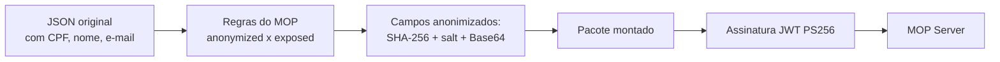
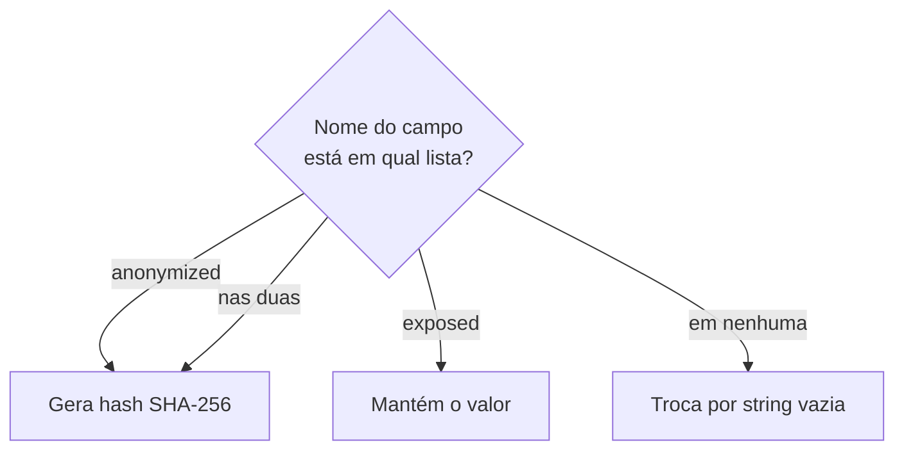
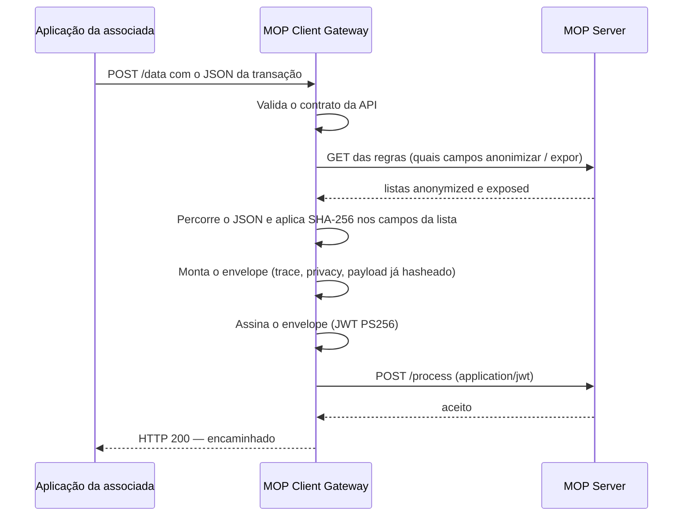

# Como o MOP Client anonimiza os campos

> **Público:** associadas participantes do Open Insurance Brasil.  
> **Objetivo:** explicar, de forma ilustrativa, **qual algoritmo** o gateway usa nos dados pessoais, **como isso acontece no fluxo** e **o que é (e o que não é) criptografia**.

---

## Em uma frase

Os campos sensíveis **não são cifrados para depois serem lidos de volta**. O gateway **substitui o valor original por um resumo irreversível (hash SHA-256 com salt)** e, em seguida, **assina o pacote inteiro** com **JWT PS256** para o MOP Server ter certeza de que a mensagem veio da associada.

| O que as pessoas chamam de “criptografia” | O que o MOP Client realmente faz | Dá para voltar ao original? |
|---|---|---|
| **Anonimização do campo** | Hash **SHA-256** + salt + **Base64** | **Não.** É mão única. |
| **Envio ao MOP Server** | Assinatura **JWS / JWT PS256** (RSA-PSS) | Não se aplica: isso **não esconde** o JSON; **autentica** o remetente. |

O método no código se chama `encrypt`, mas o algoritmo **não é AES, não é RSA de conteúdo e não é criptografia reversível**. É **hash**.

---

## Analogia

Imagine um envelope com um relatório da transação:

1. **Dentro da folha**, onde estava o CPF, o gateway **rasura o número** e escreve no lugar um código de 44 caracteres. Quem lê o relatório **não recupera o CPF**. Quem tem o mesmo CPF e o mesmo salt consegue gerar **o mesmo código** (é sempre o mesmo “carimbo”).
2. **No lacre do envelope**, a associada coloca a **assinatura digital** (JWT PS256). O MOP Server verifica o lacre e sabe: “este pacote saiu desta organização, e ninguém trocou o conteúdo no caminho”.

Rasura (hash) e lacre (assinatura) são **duas operações diferentes**. Misturá-las gera a impressão de que o MOP “descriptografa” os campos — **isso não ocorre**.



---

## 1. De onde vêm as regras (quais campos)

Antes de mexer no JSON, o gateway busca no MOP a lista de campos:

- **`anonymized`** — o valor sai do relatório; no lugar entra o hash.
- **`exposed`** — o valor segue **em claro** (útil para dados que o monitoramento precisa ler).

A comparação é pelo **nome do campo**, em minúsculas (`cpf`, `email`, `name`…). Se o mesmo nome aparecer nas duas listas, **a anonimização ganha**.

Campos que **não** estão em nenhuma das listas são **esvaziados** (`""`). O MOP Server não recebe o restante “por omissão”.



---

## 2. O algoritmo da anonimização (o “carimbo”)

Classe: `DataEncryptor`.  
Algoritmo: **SHA-256** (FIPS 180-4 / NIST).  
Codificação de saída: **Base64** (padrão Java `Base64.getEncoder()`).  
Salt fixo da aplicação: `open-insurance-mop-v1`.

Fórmula:

```text
hashBytes = SHA-256(  UTF-8(  "open-insurance-mop-v1" + valorDoCampo  )  )
valorEnviado = Base64( hashBytes )
```

Passo a passo ilustrado com um CPF fictício:

```text
1. Valor original ..............  123.456.789-00
2. Junta o salt ................  open-insurance-mop-v1 + 123.456.789-00
                                  = "open-insurance-mop-v1123.456.789-00"
3. Converte para bytes UTF-8
4. Aplica SHA-256 ..............  32 bytes
                                  (hex: e16deaeb2b146a3622b383ce3cdf4083
                                        c0c896eeb4f2faf15908bc96a2bd0f9b)
5. Codifica em Base64 ..........  4W3q6ysUajYis4POPN9Ag8DIlu608vrxWQi8lqK9D5s=
6. É isso que vai no JSON
```

### Para que serve o salt

O salt é um **prefixo fixo** (`open-insurance-mop-v1`) colado **na frente** do valor **antes** do SHA-256. Ele **não abre** o campo depois e **não é chave de criptografia**.

Sem salt, o hash de um CPF conhecido seria o mesmo SHA-256 “genérico” que aparece em tabelas públicas (listas prontas de `SHA-256(cpf)`). Com o salt, o motor hasheia **outra string**:

```text
SHA-256("123.456.789-00")                  →  hash que qualquer um já tabelou
SHA-256("open-insurance-mop-v1" + CPF)     →  hash só do contexto MOP v1
```

Assim o código enviado ao MOP **não coincide** com um SHA-256 cru daquele CPF. O valor `open-insurance-mop-v1` também **marca a versão do esquema**: se um dia o produto mudar o prefixo, hashes antigos e novos não se misturam.

Neste gateway o salt é **único e igual para todos** (não é aleatório por transação). Por isso o mesmo CPF **sempre** gera o mesmo Base64 — dá para correlacionar, mas **não** dá para “desfazer” o hash.

O salt **não é uma senha de descriptografia**. Sem o valor original, **não há operação inversa**: SHA-256 não se “desfaz”.

| Propriedade | O que significa na prática |
|---|---|
| **Mão única** | O MOP Server **não reconstrói** CPF, e-mail ou nome a partir do Base64. |
| **Determinístico** | O mesmo valor, com o mesmo salt, **sempre** gera o mesmo código. Serve para correlacionar ocorrências sem guardar o dado em claro. |
| **Tamanho fixo** | Qualquer texto vira **32 bytes** (256 bits) → cerca de **44 caracteres** em Base64. |
| **Vazio** | `null` ou string em branco **não** são hasheados; o campo sai `""`. |

Se o campo anonimizado for um objeto ou uma lista, o gateway primeiro **serializa aquele pedaço em JSON** e só então aplica o hash no texto inteiro.

---

## 3. Exemplo ilustrativo (antes e depois)

**Regras recebidas do MOP (exemplo):**

- anonimizar: `cpf`, `email`, `name`
- expor: `consentId`, `brand`

**JSON que a aplicação reporta:**

```json
{
  "consentId": "urn:opin:consent:abc-123",
  "brand": "Seguradora Exemplo",
  "cpf": "123.456.789-00",
  "email": "titular@exemplo.com",
  "name": "Maria Silva",
  "productCode": "AUTO-01"
}
```

**JSON depois da anonimização (o que segue no `payload`):**

```json
{
  "consentId": "urn:opin:consent:abc-123",
  "brand": "Seguradora Exemplo",
  "cpf": "4W3q6ysUajYis4POPN9Ag8DIlu608vrxWQi8lqK9D5s=",
  "email": "<hash SHA-256 em Base64 do e-mail>",
  "name": "<hash SHA-256 em Base64 do nome>",
  "productCode": ""
}
```

- `consentId` e `brand` → **iguais** (expostos).
- `cpf`, `email`, `name` → **só o hash** (anonimizados).
- `productCode` → **vazio**, porque não estava em nenhuma lista.

Se a montagem do JSON falhar, o gateway **não envia o original**: devolve `{}` e o fluxo trata isso como payload bloqueado.

---

## 4. Onde isso entra no fluxo do gateway

Canal de rastreio: **`POST /v1/anonymize/data`** (no deploy com context-path `/v1`).



A anonimização acontece **no perímetro da associada**, **antes** do dado sair para o MOP Server. O servidor central recebe o relatório já “raspado”.

O funil de consentimentos (`POST /v1/data-funil-consents`) **não usa** este algoritmo de campos: é outro canal, com outro contrato.

---

## 5. A segunda operação: assinatura (não é anonimização)

Depois do hash nos campos, o gateway **assina** o JSON de saída.

| Item | Valor no MOP Client |
|---|---|
| Formato | **JWT** compacto (três partes: header.payload.signature) |
| Algoritmo | **PS256** — RSA com *Probabilistic Signature Scheme* (PSS) e SHA-256 |
| Chave | **Privada RSA** da associada (PKCS#8), configurada no gateway |
| Header | `alg: PS256`, `typ: JWT`, `kid` da chave |
| Validade | `iat` agora, `exp` em **1 hora** |
| Extra | claim `orgId` da organização |

Isso responde à pergunta “o pacote é autêntico?”. **Não** substitui o hash dos campos e **não** é uma cifra do CPF.

Quem verifica no MOP Server usa a **chave pública** correspondente. Sem a chave privada, ninguém forja um JWT válido daquela `orgId`.

```text
Envelope JSON  →  claims do JWT  →  assina com RSA-PSS (PS256)  →  token
O MOP Server confere a assinatura. Os campos já chegaram hasheados dentro desse token.
```

---

## 6. Respostas diretas

**Qual algoritmo anonimiza os campos?**  
**SHA-256**, com o salt `open-insurance-mop-v1` concatenado **na frente** do valor, resultado em **Base64**.

**É criptografia?**  
No dia a dia as pessoas usam a palavra para tudo que “protege dado”. Em termos técnicos:

- anonimização = **função de hash** (resumo irreversível);
- envio = **assinatura digital** PS256 (autenticidade e integridade do pacote).

Não há chave com a qual o MOP “abra” o CPF de novo.

**Como é usado?**  
1. MOP diz quais nomes de campo hashear e quais manter.  
2. O gateway percorre o JSON.  
3. Nos campos da lista `anonymized`, troca o valor pelo Base64 do SHA-256.  
4. Assina o envelope e encaminha.

**O hash é igual para o mesmo CPF em todos os participantes?**  
Sim, para o mesmo texto e o mesmo salt da aplicação. Por isso o dado em claro **não deve** ser reconstruído no servidor — e também por isso o relatório já sai hasheado **da associada**.

---

## 7. O que este documento não afirma

- Não descreve o algoritmo como AES, 3DES, RSA de conteúdo ou “criptografia de campo reversível”.
- Não trata o salt como segredo operacional da associada: ele é **o identificador de versão do hash no produto** (`open-insurance-mop-v1`).
- Não se aplica ao funil PCM (`/data-funil-consents`).
- A mensagem HTTP 200 de sucesso do rastreio refere-se ao **encaminhamento** do evento; não significa que o JSON original foi armazenado em claro no MOP.

Implementação de referência: `DataEncryptor` (hash) e `JsonAnonymizer` (percorre o JSON); assinatura em `JwtPayloadSigner` (PS256).
