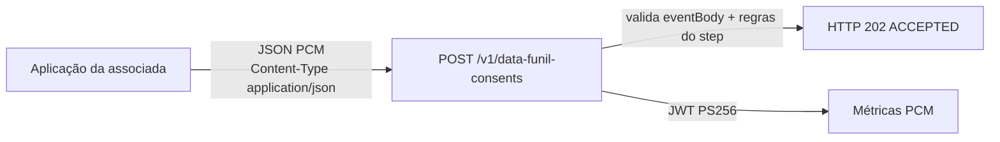
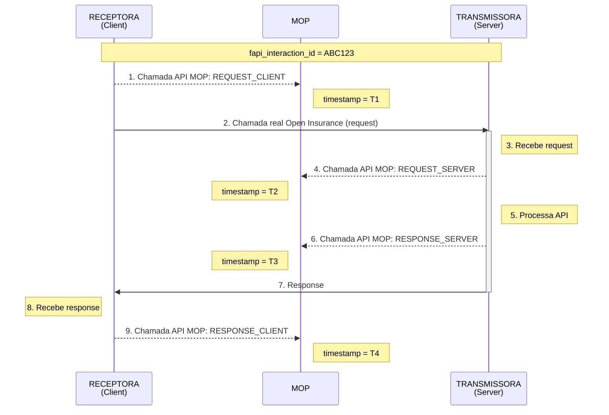
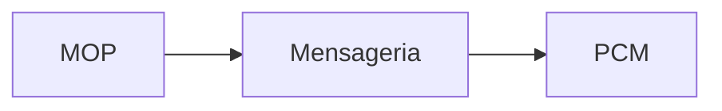

# Funil de consentimentos (PCM) — documentação

> [!WARNING]
> **Documento apenas para referência e base de desenvolvimento.**
> O conteúdo descreve o comportamento esperado do canal do funil de consentimentos, mas **não é especificação oficial** nem garante contrato ou disponibilidade em produção. Endpoints, campos e regras podem mudar sem aviso. Antes de integrar, confirme com a equipe responsável pelo MOP.

> **Público:** associadas participantes do Open Insurance Brasil.  
> **Canal:** `POST /v1/data-funil-consents`  
> **Spec:** `swagger/consent-funnel/consent-funnel.yml` (schema `ConsentCreated`)  
> **Collection:** [`collections-apresentacao/06-funil-consents-por-step.postman_collection.json`](collections-apresentacao/06-funil-consents-por-step.postman_collection.json)

Este documento descreve o ingresso de eventos do **funil de consentimentos** no MOP Client. Não usa headers de rastreio (`origin`, `path`, `httpType`). Os identificadores vão **no JSON**.

---

## 1. O que é

O participante reporta cada etapa do consentimento (criação, autenticação, autorização, uso do recurso, revogação, expiração) em um canal próprio, separado do rastreio `POST /v1/anonymize/data`.

O gateway confere se o evento está completo e coerente com o `step`, aceita o envio e encaminha a métrica ao ambiente central (JWT PS256).

| | Rastreio MOP | Funil PCM |
|---|---|---|
| Endpoint | `POST /v1/anonymize/data` | `POST /v1/data-funil-consents` |
| Headers MOP | Obrigatórios | **Não usa** |
| `origin` / `httpType` | Quatro pares: `client`/`server` × `Request`/`Response` (mesmo `X-Correlation-Id`) | `origin` no JSON (`CLIENT` ou `SERVER`); sem `httpType` |
| Body | JSON da API Open Insurance | JSON PCM (`eventBody`) |
| Fila de retry / `/process` | Sim | **Não** |
| HTTP de aceite | 200 ou 202 (retry) | **202** |



### Fluxo de registro de eventos no MOP

Interação Open Insurance entre Receptora e Transmissora, com os quatro pontos de registro no MOP.
Todas as etapas compartilham o mesmo `fapi_interaction_id` (exemplo: `ABC123`).





#### Eventos registrados no MOP

| Evento | Quem envia | Quando | Timestamp |
|---|---|---|---|
| `REQUEST_CLIENT` | Receptora | Antes de enviar a request à Transmissora | T1 |
| `REQUEST_SERVER` | Transmissora | Ao receber a request, antes de processar | T2 |
| `RESPONSE_SERVER` | Transmissora | Após processar, antes de devolver a response | T3 |
| `RESPONSE_CLIENT` | Receptora | Ao receber a response da Transmissora | T4 |

**Legenda:** seta contínua (`->>`) = tráfego real Open Insurance; seta tracejada (`-->>`) = chamada de registro no MOP.

Todos os eventos da mesma interação são correlacionados pelo `fapi_interaction_id` e seguem do MOP para a Mensageria e, depois, para a PCM.

---

## 2. Como chamar

```http
POST /v1/data-funil-consents HTTP/1.1
Host: {gateway}
Content-Type: application/json
```

Não envie `X-Correlation-Id`, `origin`, `path`, `operation` nem `httpType`. O `correlationId` está **no body**.

| HTTP | Quando |
|---|---|
| **202** | Evento aceito (`status: ACCEPTED`) e métrica entregue |
| **400** | JSON inválido ou `additionalInfo` incompleto para o `step` |
| **502** | Evento válido, mas a métrica PCM não pôde ser entregue |

Exemplo de aceite:

```json
{
  "status": "ACCEPTED",
  "correlationId": "577869e5-4c63-4b19-9235-a18d22c80986",
  "consentId": "urn:bancoex:C1DD33123",
  "step": "consent-created",
  "receivedAt": "2026-09-21T12:00:00Z"
}
```

---

## 3. Exemplo (único payload)

Toda a documentação e a collection usam **este** JSON. Em cada step muda **somente** o campo `step`.

```json
{
  "consentId": "urn:bancoex:C1DD33123",
  "step": "consent-created",
  "origin": "CLIENT",
  "correlationId": "577869e5-4c63-4b19-9235-a18d22c80986",
  "additionalInfo": {
    "consent-user": "invalid-credentials",
    "authentication-failure-reason": "invalid-credentials",
    "user-redirected-back-status": "success",
    "token-kind": "consent-token",
    "rejected-by": "user",
    "revoked-by": "user",
    "expired-by": "authorization-timeout"
  },
  "timestamp": "2022-11-07T17:26:32Z",
  "clientOrgId": "1fb79963-4bff-4204-9370-93aceb8a2f0d",
  "clientSSId": "2a59c2a3-529f-41c6-97e3-77395e9951ca",
  "serverOrgId": "ff66b95a-d817-4fbe-949a-c5912e240189",
  "serverASId": "f8cd7b48-197d-419b-8680-f42226111b6f",
  "permissions": [
    "CUSTOMERS_PERSONAL_IDENTIFICATIONS_READ"
  ]
}
```

| Campo | Obrigatório | Neste exemplo |
|---|---|---|
| `consentId` | **Sim** | `urn:bancoex:C1DD33123` |
| `step` | **Sim** | um dos 14 valores da seção 4 |
| `origin` | **Sim** | `CLIENT` ou `SERVER` |
| `correlationId` | **Sim** | `577869e5-4c63-4b19-9235-a18d22c80986` |
| `timestamp` | **Sim** | `2022-11-07T17:26:32Z` |
| `clientOrgId` / `clientSSId` | **Sim** (UUID) | receptora |
| `serverOrgId` / `serverASId` | **Sim** (UUID) | transmissora |
| `permissions` | **Sim** | `CUSTOMERS_PERSONAL_IDENTIFICATIONS_READ` |
| `additionalInfo` | Não (chaves internas opcionais) | ver seção 5 |

Nesta spec os campos de `additionalInfo` são string livre. O exemplo acima é aceito como está.

---

## 4. Os 14 steps

Cada linha é um `POST` na collection, com o JSON da seção 3 e o `step` da coluna.

| # | `step` | Quem reporta (spec PCM) | `additionalInfo` exigido |
|---|---|---|---|
| 01 | `consent-created` | Cliente e servidor | `consent-user` |
| 02 | `user-redirected` | Cliente e servidor | — |
| 03 | `user-authentication-failed` | Servidor | `authentication-failure-reason` |
| 04 | `user-authenticated` | Servidor | — |
| 05 | `consent-authorized` | Servidor | — |
| 06 | `consent-rejected` | Servidor | `rejected-by` |
| 07 | `authorization-code-created` | Servidor | — |
| 08 | `user-redirected-back` | Cliente e servidor | `user-redirected-back-status` |
| 09 | `consent-token-generated` | Servidor | — |
| 10 | `consent-token-received` | Cliente | — |
| 11 | `refresh-token-used` | Cliente e servidor | — |
| 12 | `resource-accessed` | Cliente e servidor | `token-kind` |
| 13 | `consent-revoked` | Cliente e servidor | `revoked-by` |
| 14 | `consent-expired` | Cliente e servidor | `expired-by` |

O gateway **não impede** o cliente de enviar um step listado só no servidor (e o contrário). A coluna “quem reporta” é a classificação da spec PCM.

---

## 5. `additionalInfo` por step

O objeto pode trazer todas as chaves (como no exemplo). Nesta spec **não há enum** nem chave obrigatória por step.

| Chave | Obrigatória quando `step` é | Valores aceitos |
|---|---|---|
| `consent-user` | `consent-created` | `user`, `non-user` |
| `authentication-failure-reason` | `user-authentication-failed` | `invalid-credentials`, `invalid-mfa`, `other` |
| `user-redirected-back-status` | `user-redirected-back` | `success`, `failure` |
| `token-kind` | `resource-accessed` | `consent-token`, `client-credential` |
| `rejected-by` | `consent-rejected` | `user`, `system` |
| `revoked-by` | `consent-revoked` | `user`, `system` |
| `expired-by` | `consent-expired` | `authorization-timeout`, `max-date-reached` |

HTTP **400** só se faltar algum dos quatro IDs obrigatórios ou o tipo do campo não casar com a spec.

---

## 6. Collection Postman

Arquivo: [`06-funil-consents-por-step.postman_collection.json`](collections-apresentacao/06-funil-consents-por-step.postman_collection.json)

1. Importe a collection.
2. `baseUrl` padrão (ambiente de desenvolvimento): `http://localhost:8080/v1/anonymize`. URL completa: `POST http://localhost:8080/v1/anonymize/data-funil-consents`.
3. Execute os 14 requests **em ordem**, ou o folder inteiro.

Esperado em cada um: **HTTP 202** quando o JSON passa na spec e a métrica PCM responde; **400** se o enum de `consent-user` for rejeitado; **502** se o PCM estiver fora.

---

## 7. O que este canal não faz

- Não anonimiza campos (SHA-256). Isso é só do rastreio `POST /data`.
- Não usa fila RabbitMQ de retry.
- Não envia ao MOP `/process`.
- Não substitui o reporte da API Consents (`CreateConsent` / `ResponseConsent`). Funil e rastreio convivem.

Referência de implementação: `ConsentFunnelController`, `ConsentFunnelOpenApiValidator`, `swagger/consent-funnel/consent-funnel.yml`.

---

## 8. Referências

Este documento é o item **11** do [sumário do README](../README.md#sumário).

- [README — Funil de consentimentos (PCM)](../README.md#funil-de-consentimentos-pcm--documentação)
- [`ALERTA_HEADERS_README.md`](ALERTA_HEADERS_README.md) — headers FAPI × MOP × funil PCM
- [`release-notes.md`](release-notes.md#v1-0-7) — novidade na 1.0.7
- [`06-funil-consents-por-step.postman_collection.json`](collections-apresentacao/06-funil-consents-por-step.postman_collection.json)
