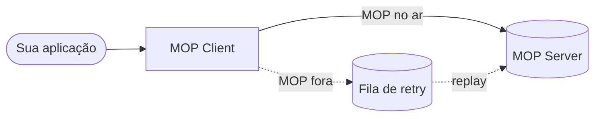

# Release Notes

Notas de versão do **MOP Client**, no estilo do ecossistema MOP (New features, Enhancements, Bug fixes).

*Última atualização do documento: 29 de abril de 2026.*

### Em produção

- **MOP disponível:** o pedido é concluído na hora e a API responde **`200`** — o rastreio segue para o servidor MOP como esperado pela regulação.
- **MOP indisponível ou instável:** a API responde **`202`** e o pedido fica **retido para nova tentativa**; quando o ambiente normaliza, o reenvio ocorre **sem** a aplicação participante ter de repetir a chamada manualmente.
- **Infraestrutura:** o **broker de mensagens** usado pela fila de retry tem de estar **sempre disponível** à altura do volume esperado; sem ele, não há garantia de enfileiramento nem de reprocessamento.
- **Operação:** convém **acompanhar** saúde da aplicação, profundidade da fila e indisponibilidades do MOP (por exemplo via *health checks* e métricas), e tratar o modelo como **pelo-menos-uma-vez** — o identificador de correlação deve ser **único por intenção de negócio** para o lado receptor poder deduplicar, se necessário.

---

## Versions

- [1.0.0](#v1-0-0)

---

## 1.0.0

Esta é a **primeira entrega unificada** da solução que os participantes do Open Insurance utilizam para conferir, preparar e enviar ao **MOP** os eventos de rastreio exigidos pela regulação. Antes era necessário instalar e cuidar de **dois serviços distintos** (validação por um lado, anonimização por outro); agora tudo se concentra em **uma única aplicação**, com um fluxo contínuo do pedido recebido até a entrega ao ambiente central.

A versão **1.0.0** agrupa num só pacote o que, em outra abordagem, poderia ter sido lançado em fases separadas. **Se o MOP ou a rede falharem no momento do envio**, o pedido **não se descarta**: fica guardado para **tentativa posterior**, sem obrigar o cliente que chamou a API a resolver o reenvio manualmente. A **forma de configurar o ambiente** foi simplificada e padronizada, e a **documentação foi alinhada ao comportamento real da aplicação**, para quem implanta e opera saber exatamente o que definir em cada ambiente — com menos ambiguidade entre o que está escrito e o que acontece em produção.

As secções seguintes detalham, por categoria, as capacidades incluídas neste lançamento.

### New features

#### API HTTP unificada

- Endpoint **`POST /data`** (com `server.servlet.context-path` padrão **`/v1/anonymize`** → URL completa `POST /v1/anonymize/data`).
- Fluxo único: validação de headers → parse JSON opcional → validação OpenAPI → busca de regras de anonimização no MOP → anonimização → assinatura JWS (quando habilitada) → envio ao **`/process`** do MOP.

#### Resiliência

- **Resilience4j**: circuit breakers `mopAnonymizationConfig` (GET das regras) e `mopProcessEndpoint` (POST ao MOP).
- **Semântica HTTP explícita**: **`200 OK`** quando o payload é entregue ao MOP de forma síncrona; **`202 Accepted`** com `status: ACCEPTED` quando o MOP está indisponível e o pedido é **persistido na fila de retry** (`mop.client.retry.queue`).
- **Sonda de disponibilidade** do MOP (configurável em `mop.server.availability.*`) com métricas para observabilidade, sem depender do circuit breaker da config de anonimização.

#### Reprocessamento

- Fila **RabbitMQ** dedicada ao retry do cliente (`mop.client.retry.queue` e propriedades `mop.client.retry.*`).
- **Replay agendado** que drena a fila quando o broker e o MOP voltam ao normal (`replay.enabled`, intervalos e lotes configuráveis por profile).

#### Release notes

- Documentação de versão em **`docs/release-notes.md`** e página estática **`release-notes.html`** (servida em `/v1/anonymize/release-notes.html`).

### Enhancements

#### Melhorias no YAML e unificação de configuração

- **Namespace `mop.*`** centralizado: endpoints (`mop.endpoints.process`, `mop.endpoints.anonymization-config`), assinatura (`mop.payload-signing.*`), cliente retry (`mop.client.retry.*`) e disponibilidade (`mop.server.availability.*`).
- **URLs do MOP** apenas como URL completa, via **`MOP_PROCESS_URL`**, **`MOP_ANONYMIZATION_CONFIG_URL`** e **`MOP_PROCESS_METHOD`**, alinhadas a `mop.endpoints` — eliminação do modelo legado com composição host/path e prefixo `EXTERNAL_*` fragmentado.
- **Variáveis de ambiente** e **README** / **`docs/VARIAVEIS_DE_AMBIENTE.md`** harmonizados com o `application.yml`, evitando divergência entre documentação e o que o Boot resolve no boot.

#### Contrato e documentação (OpenAPI)

- Especificação **`mop-gateway-api-specification.yml`** atualizada com respostas **`200`** (entrega síncrona) e **`202`** (aceite para entrega assíncrona), incluindo o schema **`AcceptedResponse`**.
- **README** descreve o contrato 200 vs 202 e as variáveis obrigatórias / opcionais em linha com o projeto.

### Bug fixes

- Não reportados.

---

**Projeto:** [github.com/br-openinsurance-infra/opin-mop-gateway](https://github.com/br-openinsurance-infra/opin-mop-gateway)
