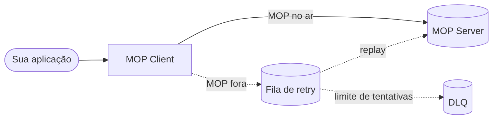

# Release Notes

Notas de versão do **MOP Client**, no estilo do ecossistema MOP (New features, Enhancements, Bug fixes).

**Última atualização do documento: 28 de junho de 2026.**

### Em produção

- **MOP disponível:** o pedido é concluído na hora e a API responde **`200`** — o rastreio segue para o servidor MOP como esperado pela regulação.
- **MOP indisponível ou instável:** a API responde **`202`** e o pedido fica **retido para nova tentativa**; quando o ambiente normaliza, o reenvio ocorre **sem** a aplicação participante ter de repetir a chamada manualmente.
- **Infraestrutura:** o **broker de mensagens** usado pela fila de retry tem de estar **sempre disponível** à altura do volume esperado; sem ele, não há garantia de enfileiramento nem de reprocessamento.
- **Operação:** convém **acompanhar** saúde da aplicação, profundidade da fila e indisponibilidades do MOP (por exemplo via *health checks* e métricas), e tratar o modelo como **pelo-menos-uma-vez** — o identificador de correlação deve ser **único por intenção de negócio** para o lado receptor poder deduplicar, se necessário.
- **DLQ:** após esgotar as tentativas de replay (`mop.client.retry.dlq.max-attempts`), o evento vai para a fila **`mop.client.retry.dlq`**; o **reprocessamento a partir da DLQ é responsabilidade do participante**.

---

---

## Versões da release note
- [1.0.4 (2026-06-02)](#v1-0-4)
- [1.0.3 (2026-06-02)](#v1-0-3)
- [1.0.2 (2026-05-19)](#v1-0-2)
- [1.0.1 (2026-05-07)](#v1-0-1)
- [1.0.0 (2026-04-29)](#v1-0-0)

---
---

## 1.0.4

### New features

- **Validações reportadas às participantes (MOP Client)**: o gateway passa a devolver, na resposta HTTP de sucesso (`200` ou `202`), o objeto **`validations`** com `status`, `total` e `pending`, resultado das checagens OpenAPI (e demais validações do fluxo), permitindo que a aplicação participante **analise advertências e inconsistências** sem depender apenas de logs internos.
- **Fila de DLQ (Dead-Letter Queue)**: quando um evento na fila de retry (`mop.client.retry.queue`) **excede o número máximo de tentativas** configurado (`mop.client.retry.dlq.max-attempts`, padrão **5**), o MOP Client **encaminha automaticamente** o payload para a fila **`mop.client.retry.dlq`**, com metadados de rastreio (`correlationId`, `dlqReason`, `lastFailureDetail`, contador de tentativas). O **consumo e reenvio** a partir da DLQ ficam sob responsabilidade do **participante**.

### Enhancements

- **`clientSSId` opcional**: o header `clientSSId` deixa de ser obrigatório no contrato do gateway. Esse identificador **só se aplica às fases 2 e 3** do Open Insurance; integrações que não operam nessas fases podem omitir o header. Quando ausente, a resposta HTTP utiliza `origin` como fallback e o trace interno segue o processamento normalmente.
- **Acoplamento `origin` / `httpType` / `statusCode`**: apenas `client`+`Request` (valida requestBody) ou `server`+`Response`+`statusCode` (valida response body da spec). Combinações inconsistentes retornam HTTP 400.
- **`request.header` na resposta**: eco dos headers HTTP recebidos no objeto `request` das respostas 200/202.
- **Pré-carga de specs OpenAPI no startup**: log `[OPENAPI]` e verificação da rota consents v3 no boot.
- **Documentação**: README, `PATH_MOP_HEADER.md`, cenários QA e especificação do gateway alinhados ao contrato `origin`/`httpType`/`statusCode` e ao path MOP completo.

### Bug fixes

- **Validação OpenAPI com path relativo**: corrigida falha em que o validador openapi4j recebia apenas o segmento da operação (ex.: `/consents`) em vez do path MOP completo (`/open-insurance/consents/v3/consents`), gerando `Operation path not found` com headers corretos.
- **Header `path` incompleto**: rejeição explícita (HTTP 400) quando o path não normaliza para `/open-insurance/...`.

---

## 1.0.3

### New features

- **Nova versão disponibilizada para deploy**: esta release marca a disponibilização de uma nova versão do MOP Client para implantação nos ambientes dos participantes.
- **Versão promovida para produção**: a versão foi incluída no ambiente de produção, ficando disponível para utilização operacional conforme o cronograma de implantação de cada participante.
- **URL de produção:** https://mop-server-entrypoint.opinbrasil.com.br/

### Enhancements

- **Atualização de versão**: consolidação das melhorias e correções entregues nas versões anteriores, mantendo alinhamento entre os ambientes homologados e o ambiente produtivo.
- **Comunicação de disponibilidade**: documentação atualizada para refletir a nova versão disponibilizada e sua respectiva entrada em produção.

### Bug fixes

- Não reportados nesta versão.

---

## 1.0.2

### New features

- **Header opcional `traceOrigin`**: novo header HTTP para indicar a origem do evento de trace (ex.: `CLIENT`, `SERVER`). Quando informado, o valor é enviado ao servidor MOP no rastreio do evento e mantido nas tentativas de reenvio quando o MOP estiver indisponível.

### Enhancements

- **Headers opcionais de trace**: `traceOrigin` e `X-Mop-Reportid` permanecem **não obrigatórios** — a requisição segue normalmente se forem omitidos; o gateway preenche valores padrão quando necessário (etapa do fluxo e data do passo derivados internamente no `MessageDTO`, identificador de relatório MOP).
- **Documentação do contrato da API**: especificação OpenAPI, README e guia de cenários de QA atualizados com a lista de headers **obrigatórios** e **opcionais**, incluindo exemplos de requisição mínima e completa.

### Bug fixes

- Não reportados nesta versão.

---

## 1.0.1

### New features

- **Bloqueio de múltiplos body**: uma única request deve conter **um único payload**; requisições com múltiplos body **não são aceitas**.

### Enhancements

- A funcionalidade de **múltiplos body** **não está mais disponível**.

### Bug fixes

- fix(chamado 19650) (2026-05-07): avoid PayloadSigner init when signing disabled
  - Data da correção: 2026-05-07
  - When `MOP_PAYLOAD_SIGNING_ENABLED=false` and JWS variables are missing or blank (*variáveis ausentes/em branco*), prevent Spring startup failures (*falha na inicialização do Spring*) by skipping `JwtPayloadSigner` instantiation (PEM/Base64 decode) and enforcing signing prerequisites (*pré-requisitos de assinatura*) only when signing is enabled.

---

## 1.0.0

Esta é a **primeira entrega unificada** da solução que os participantes do Open Insurance utilizam para conferir, preparar e enviar ao **MOP** os eventos de rastreio exigidos pela regulação. Antes era necessário instalar e cuidar de **dois serviços distintos** (validação por um lado, anonimização por outro); agora tudo se concentra em **uma única aplicação**, com um fluxo contínuo do pedido recebido até a entrega ao ambiente central.

A versão **1.0.0** agrupa num só pacote o que, em outra abordagem, poderia ter sido lançado em fases separadas. **Se o MOP ou a rede falharem no momento do envio**, o pedido **não se descarta**: fica guardado para **tentativa posterior**, sem obrigar o cliente que chamou a API a resolver o reenvio manualmente. A **forma de configurar o ambiente** foi simplificada e padronizada, e a **documentação foi alinhada ao comportamento real da aplicação**, para quem implanta e opera saber exatamente o que definir em cada ambiente — com menos ambiguidade entre o que está escrito e o que acontece em produção.

As secções seguintes detalham, por categoria, as capacidades incluídas neste lançamento.

### New features

#### API HTTP unificada

- Endpoint **`POST /data`** (com `server.servlet.context-path` padrão **`/v1/anonymize`** → URL completa `POST /v1/anonymize/data`).
- Fluxo único: validação de headers → parse JSON opcional → validação OpenAPI → busca de regras de anonimização no MOP → anonimização → assinatura JWS (quando habilitada) → envio ao **`/process`** do MOP.

#### Resiliência

- **Resilience4j**: circuit breakers `mopAnonymizationConfig` (GET das regras) e `mopProcessEndpoint` (POST ao MOP).
- **Semântica HTTP explícita**: **`200 OK`** quando o payload é entregue ao MOP de forma síncrona; **`202 Accepted`** com `status: ACCEPTED` quando o MOP está indisponível e o pedido é **persistido na fila de retry** (`mop.client.retry.queue`).
- **Sonda de disponibilidade** do MOP (configurável em `mop.server.availability.*`) com métricas para observabilidade, sem depender do circuit breaker da config de anonimização.

#### Reprocessamento

- Fila **RabbitMQ** dedicada ao retry do cliente (`mop.client.retry.queue` e propriedades `mop.client.retry.*`).
- **Replay agendado** que drena a fila quando o broker e o MOP voltam ao normal (`replay.enabled`, intervalos e lotes configuráveis por profile).

### Enhancements

#### Melhorias no YAML e unificação de configuração

- **Namespace `mop.*`** centralizado: endpoints (`mop.endpoints.process`, `mop.endpoints.anonymization-config`), assinatura (`mop.payload-signing.*`), cliente retry (`mop.client.retry.*`) e disponibilidade (`mop.server.availability.*`).
- **URLs do MOP** apenas como URL completa, via **`MOP_PROCESS_URL`**, **`MOP_ANONYMIZATION_CONFIG_URL`** e **`MOP_PROCESS_METHOD`**, alinhadas a `mop.endpoints` — eliminação do modelo legado com composição host/path e prefixo `EXTERNAL_*` fragmentado.
- **Variáveis de ambiente** e **README** / **`docs/VARIAVEIS_DE_AMBIENTE.md`** harmonizados com o `application.yml`, evitando divergência entre documentação e o que o Boot resolve no boot.

#### Contrato e documentação (OpenAPI)

- Especificação **`mop-gateway-api-specification.yml`** atualizada com respostas **`200`** (entrega síncrona) e **`202`** (aceite para entrega assíncrona), incluindo o schema **`AcceptedResponse`**.
- **README** descreve o contrato 200 vs 202 e as variáveis obrigatórias / opcionais em linha com o projeto.
 
### Bug fixes

- Não reportados.

---

**Projeto:** [github.com/br-openinsurance-infra/opin-mop-gateway](https://github.com/br-openinsurance-infra/opin-mop-gateway)
